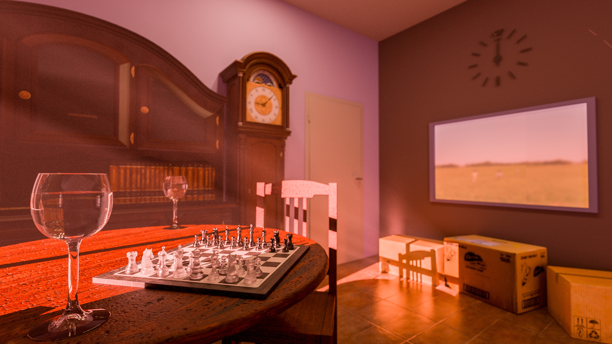

A C++ implementation of a ray tracing rendering engine based on [Nori](https://wjakob.github.io/nori/), originally developed for the [Advanced Computer Graphics](https://edu.epfl.ch/coursebook/en/advanced-computer-graphics-CS-440) course at EPFL and passed with 6/6.

Final scene showcasing most of the features, rendered with volume rendering. [Uncompressed version](./results/project/Final_image/base3_alternate_2048samples_Edited.png)

## Main features
- Volume rendering with multiple homogenous participating media
- Multiple importance sampling
- Texture and normal mapping
- Multiple materials, including rough and smooth dielectrics and conductors
- Point, area, directional and image-based lights
- Environment maps
- Depth of field
- Incremental rendering

## Available reports

| Topics   |  Links
| ---------: | ---------------------------------------------
| Project setup and dummy integrators          | [report.html](results/homework-1/report.html)
| Octree optimization          | [report.html](results/homework-2/report.html)
| Probability distributions, point lights, ambient occlusion, hierarchical sample warping          | [report.html](results/homework-3/report.html)
| Area lights, Whitted-style ray tracing, dielectrics         | [report.html](results/homework-4/report.html)
| Path tracing, next event estimation, multiple importance sampling, microfacet BRDF          | [report.html](results/homework-5/report.html)
| Final scene          | [report.html](results/project/report.html)
